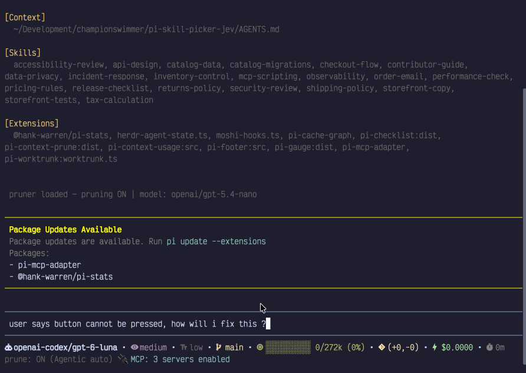
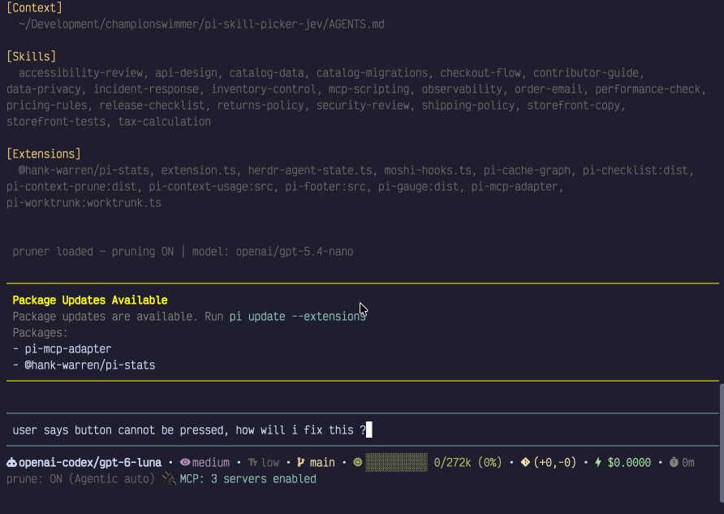

# Skill Picker for Pi

Pi can load many skills, but most tasks need only a few. This extension asks [Jev](https://openrouter.ai/) which of your available skills fit the task, then shows Pi only those skills instead of the whole catalog. Pi still loads a skill's full instructions only when it needs them.

## A smaller initial system prompt

On the 20-skill [storefront demo](demo/README.md), the extension reduces the initial system prompt by about **1,000 tokens**: skills are selected for the request instead of sending the whole catalog.

| Without Skill Picker | With Skill Picker |
| --- | --- |
|  |  |

## Install

Requires Pi 0.87.1+ and an OpenRouter API key available to Pi (or a [compatible decision server](docs/usage.md#use-a-different-decision-server)).

```bash
pi install git:github.com/championswimmer/pi-skill-picker-jev
pi auth check --provider openrouter
```

Start Pi in your project and work as usual. The extension uses the skills Pi already discovers; it does not find or install skills for you. You may still invoke a skill yourself with `/skill:name`.

> **Privacy:** By default, the picker sends your request, recent conversation and tool text, and skill names and descriptions to OpenRouter for ranking. It does **not** send full skill files. If that material is sensitive, use a trusted [decision server](docs/usage.md#use-a-different-decision-server) or do not use the extension.

## Everyday use

The picker runs on each new prompt and, by default, checks again after new text from tools. You'll see **Picking Skills** while it decides. Skills it selects stay available for the session; a new session starts fresh.

- `/skill-picker` opens the menu.
- `/skill-picker settings` adjusts how selective the picker is, how many skills it adds, and when it checks. You can also mark skills **Always allowed** for the current project.
- `/skill-picker history` shows which skills were added this session and their ratings.

If the decision service is unavailable or has no credentials, the picker does **not** show Pi the full skill catalog as a fallback. Already selected and project always-allowed skills remain available.

For a hands-on project with 20 skills, try the [storefront demo](demo/README.md). For setting defaults, the Always allowed editor, and using local Kev or another decision server, see the [usage guide](docs/usage.md).

For contributors: [AGENTS.md](AGENTS.md) covers implementation and development; [scoring research](docs/scoring-research.md) covers the ranking experiments.
