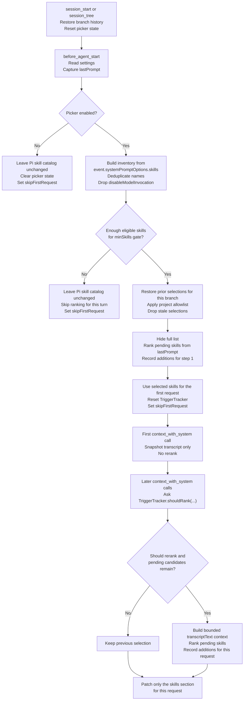
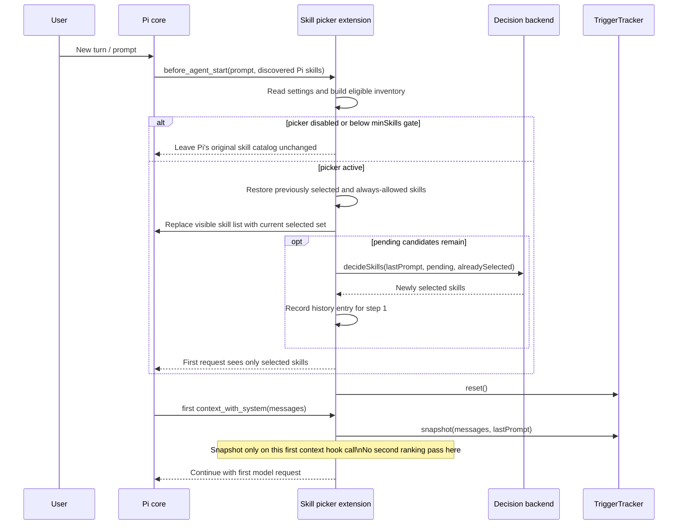
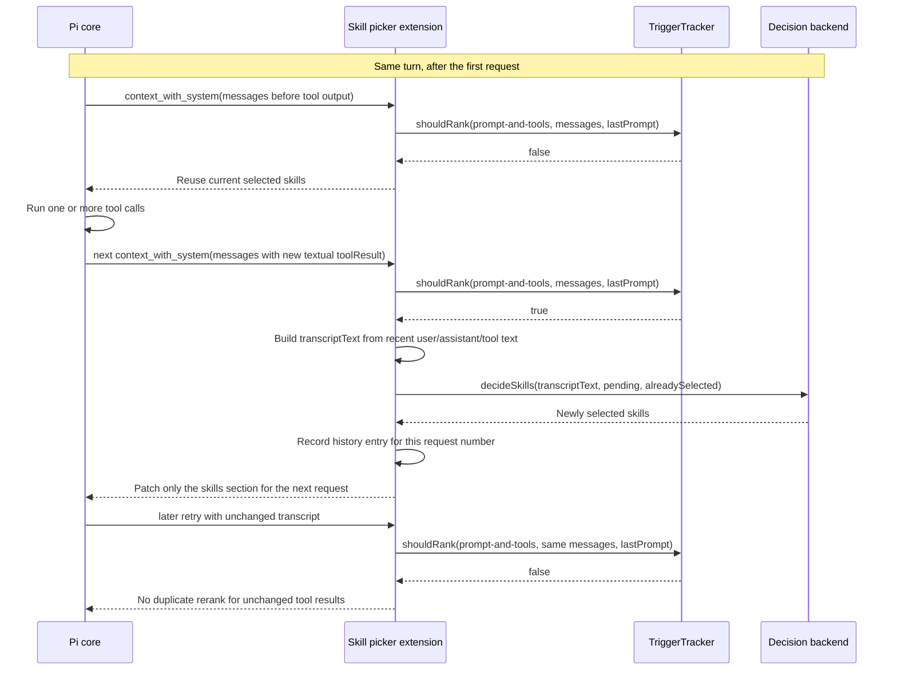
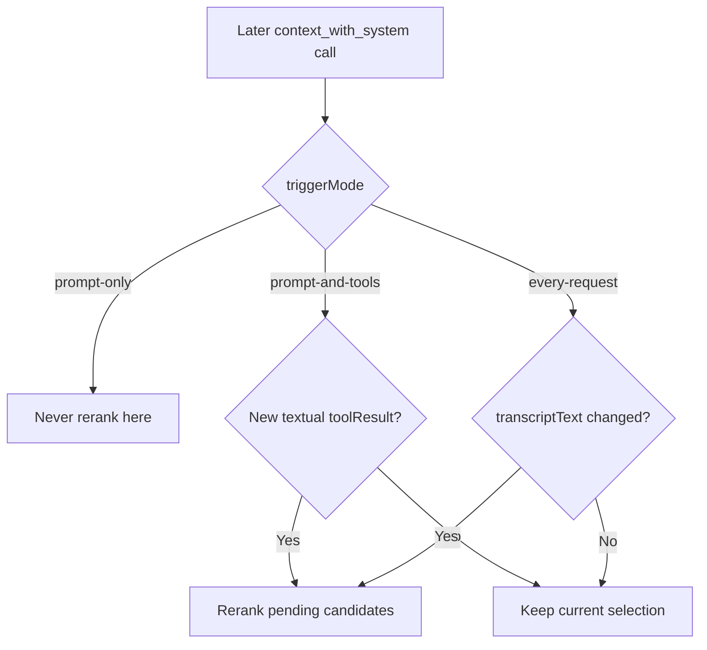

# How Skill Picker works

This document explains **when** the skill picker runs, **what context it uses**, and **how skills get added across a turn**.

It complements the user-facing [README](../README.md), [usage guide](./usage.md), and [implementation notes](./implementation.md).

## Short version

The extension makes skill-picking decisions in two places:

1. **`before_agent_start`** — once at the start of a turn, before Pi makes the first model request for that turn.
2. **`context_with_system`** — on later model requests in the same turn, while Pi is rebuilding request context and system sections.

By default, the incremental pass happens in **`prompt-and-tools`** mode, which means:

- the extension **does not** re-pick on every request,
- it **does not** react to streaming updates or assistant prose alone,
- it **does** re-pick when Pi is about to make another model request **after new completed textual tool results have appeared**.

In practice, that usually means **after a batch of tool calls finishes and Pi is about to continue**, the picker gets another chance to add more skills.

## Lifecycle overview

## Timing: initial turn setup

The **first** skill-picking pass happens before the first model request of the turn.

## Timing: repicking after tool results

The default mode is **`prompt-and-tools`**. In that mode, later repicking happens **just before the next model request**, after the conversation now contains a **new completed textual `toolResult`**.

That is why it often feels like it runs **after a batch of tool calls**: Pi finishes a burst of tools, then when it is about to ask the model what to do next, the picker checks whether those tool results changed the task enough to expose more skills.

## What counts as a rerank trigger?

### Default: `prompt-and-tools`

This is the default setting.

A later rerank happens only when all of these are true:

- the picker is enabled,
- the turn passed the `minSkills` gate,
- there are still pending candidates that have not been selected yet,
- Pi is in a later `context_with_system` call for the same turn,
- and the transcript now includes a **new textual completed `toolResult`** that `TriggerTracker` has not seen before.

It does **not** rerank for:

- assistant text alone,
- thinking blocks,
- image-only or non-text tool output,
- repeated retries with unchanged tool results,
- or the first `context_with_system` call after `before_agent_start`.

### Other modes

- **`prompt-only`** — pick once at turn start, then never incrementally rerank.
- **`prompt-and-tools`** — rerank only after new textual tool results appear.
- **`every-request`** — rerank whenever the extracted bounded transcript changes, even without tool output.

## What context is sent to the ranker?

The picker does **not** send full skill files.

Instead it ranks against a bounded text summary built from:

- recent `user` text,
- recent `assistant` text,
- recent textual `toolResult` blocks,
- plus the current turn prompt (`lastPrompt`).

The helper is `transcriptText(...)` in `src/picker.ts`. It:

- keeps only text blocks,
- ignores non-text blocks,
- keeps only the most recent conversation slice,
- and bounds the final payload length.

## What gets patched into Pi's prompt?

Two related but different things happen:

1. In **`before_agent_start`**, the extension directly replaces `event.systemPromptOptions.skills` with the selected subset for the first request.
2. In later **`context_with_system`** calls, it returns a **request-local system section override** that replaces **only** the `skills` section.

Everything else in Pi's system prompt remains intact.

## Important edge cases

- **Fail closed for eligible turns:** if ranking fails during an active picked turn, the extension does not reveal the full skill catalog.
- **Below the `minSkills` gate:** the picker does not activate for that turn, so Pi keeps its normal discovered skill list.
- **Selected skills stick for the session branch:** once added, skills remain available for later requests in that branch during the same session.
- **Only pending skills are ranked later:** already selected skills are not rescored each time.
- **One rerank per changed request:** many tool calls can collapse into one later rerank decision.

## Source map

If you want to trace this behavior in code:

- `src/extension.ts` — hook timing, prompt replacement, turn/request bookkeeping.
- `src/triggers.ts` — incremental rerank rules.
- `src/picker.ts` — transcript extraction and backend batch ranking.
- `src/history.ts` — restoring earlier additions for the active branch.
- `docs/usage.md` — settings-oriented explanation of trigger modes.
